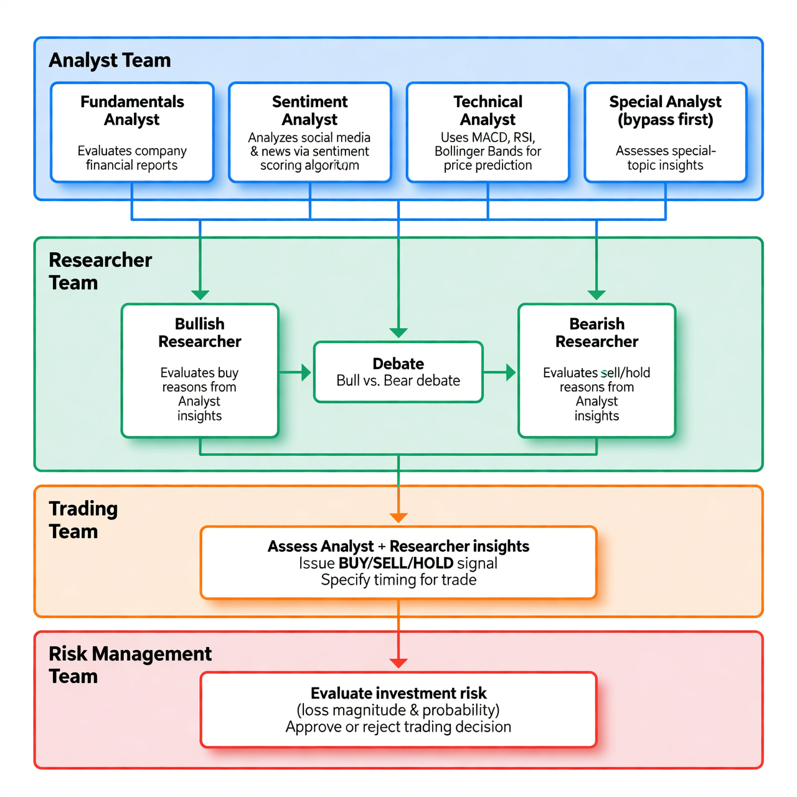

# FinAgents
***
Finance Agents on secondary market

# Flowchart
FinAgents is a multi-agent trading framework that mirrors the real-world trading firms which takes reference to project TradinAgents. By deploying LLM-powered agents: from fundamental analysts, sentiment experts, and technical analysts, to trader, risk management team, the platform collaboratively evaluates market conditions and informs trading decisions.


# Installation
### Environment Setup
##### windows
```cmd
./setup.cmd
```
##### linux
```shell
./setup.sh
```

##### frontend
```shell
cd web
npm install
```

### Vector DB Setup
##### windows
```cmd
./vector-db-setup.cmd
```
##### linux
```shell
./vector-db-setup.sh
```

# Required APIs
Alpha Vantage API Key is required for the project (standard API rate limit is 25 requests per day)

# Configuration
Copy ./config/.env.example to .env
Fill in the OpenRouter Key, Alpha Vantage API Key, model name etc. in the .env file.

# Execution

## Web UI
**backend**
```shell
python finagent_api.py # for development
# pm2 start "/app/workspace/finAgent/start_backend.sh" --name finagent_be | pm2 save | pm2 restart finagent_be | pm2 show finagent_be | pm2 logs finagent_be [--lines 1000]  # for production
```
- http://localhost:8000/

**frontend**
```shell
cd web
npm run dev # for development
# npm run build # for production 
# pm2 start "npm run preview" --name finagent_ui | pm2 save | pm2 startup | pm2 show finagent_ui  # for pre-production
# nginx for production
```
- http://localhost:3001
- http://{yourServerIp}:4173  # npm run preview

## CLI
**Sample python script to run the project**
```python
python finagent.py --symbol GOOG --period short+
```
**Sample linux shell script to run the project**
```shell
finagent.sh GOOG short+
```
**Sample windows bat script to run the project**
```cmd
finagent.bat GOOG short+
```
- **symbol**: ticker
- **period**: *short+* within 2 weeks; *short* from 2 weeks to 1 month; *medium* from 1 month to 1 year; *long* from 1 year to 2 years

**Sample output to the console**
```shell
...
========== Researcher Debate ==========
Bull: Hey Bear, let's cut through the noise—you're probably harping on Alphabet's "sky-high valuation," antitrust headaches, or some short-term technical wobble like that VWAP gap or fading MACD momentum. Fair enough, but let's stack up the facts and watch your case crumble. As the Bull Analyst, I'm here to show why GOOG (Alphabet Class C) isn't just a hold—it's a compounding machine with explosive growth ahead, trading at a steal around $310-312 with analyst targets at $328. This is a $3.97T behemoth...
...
========== Trading Plan ==========
### Trader Plan for GOOG
- **Trading Signal**: BUY
- **Trading Timing**: Buy on dips above $305 support level; initial entry at or below current levels (~$311) for momentum confirmation above $312 resistance.    
- **Reason for Trading**: Bull case prevails narrowly (55-45) on superior long-term fundamentals (AI/cloud growth, moats, PEG 1.74 undervaluation) outweighing short-term technical weakness (RSI 43, MACD fade). Diversified revenue and $10T TAM support upside in 3 months, with flawless Q4 execution as catalyst.

1. **PROPOSAL**: **BUY**
2. **TARGET PRICE**: $325 (USD)
3. **FORECAST PERIOD**: 3 months
4. **CONFIDENCE**: 0.60
5. **RISK SCORE**: 0.55
6. **LAST CLOSE PRICE**: $311.00
...
```

**Sample output as report (e.g. Linux terminal)**
```shell
glow ./results/result_yyyymmdd_nnnn.md
```

# Disclaimer
Trading performance may vary based on many factors, including the chosen backbone language models, model temperature, trading periods, the quality of data, and other non-deterministic factors. It is not intended as financial, investment, or trading advice.