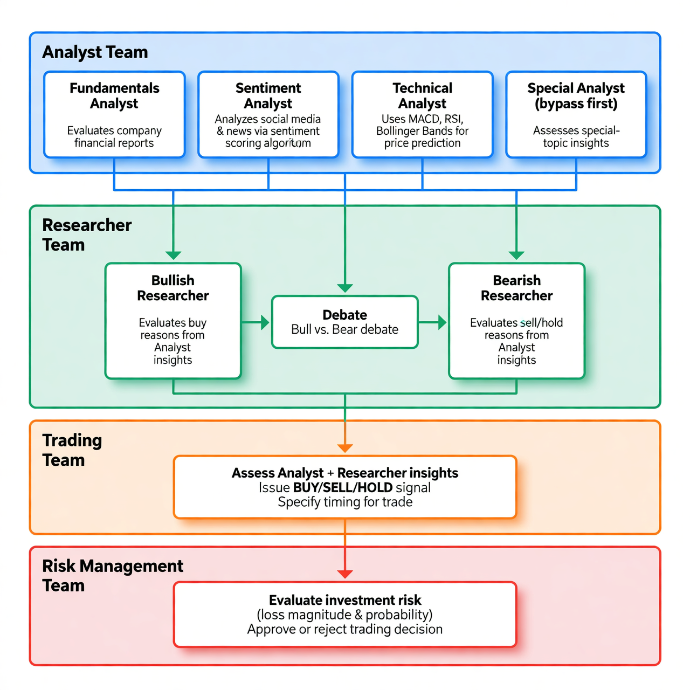

# FinAgents
***
AI-Powered Financial Analysis Platform with Multi-Stock Parallel Processing

## Overview
FinAgents is a multi-agent trading framework that mirrors real-world trading firms. By deploying LLM-powered agents: from fundamental analysts, sentiment experts, and technical analysts, to trader, risk management team, the platform collaboratively evaluates market conditions and informs trading decisions.



## Key Features

### 🚀 Parallel Processing
- **Multi-Stock Analysis**: Analyze 1-5 stocks simultaneously
- **Inner Parallelism**: Steps 1-7 run in parallel per stock (7 workers)
- **Bull/Bear Parallel**: Step 8.1 and 8.2 run concurrently

### 🔍 Searchable Ticker Input
- Type company name, alias, or ticker to search
- Example: "google" → shows GOOG, GOOGL
- Keyboard navigation (↑/↓/Enter/Tab)
- Supports comma/semicolon separators
- Maximum 5 symbols per analysis

### 📊 10-Step Analysis Pipeline
| Step | Name | Data Source | LLM Provider |
|------|------|-------------|--------------|
| 1 | Fundamentals | yfinance | - |
| 2 | Sentiment & Social | yfinance + Reddit | - |
| 3 | Technical | yfinance | - |
| 4 | Market Overview | yfinance | - |
| 5 | Global Economy | World Bank API | - |
| 6 | Fund Holdings | - | agnes-2.0-flash (Agnes AI) |
| 7 | Past Lessons | Qdrant DB | - |
| 8.1 | Bull Analysis | - | xiaomi/mimo-v2.5 (ZenMux) |
| 8.2 | Bear Analysis | - | minimax/minimax-m3 (ZenMux) |
| 8.3 | Research Debate | - | z-ai/glm-5.2 (ZenMux) |
| 9 | Trading Plan | - | z-ai/glm-5.2 (ZenMux) |
| 10 | Lesson Summary | - | agnes-2.0-flash (Agnes AI, background) |

### 🤖 Multi-Provider LLM Support
| Provider | URL | API Key |
|----------|-----|---------|
| ZenMux | https://zenmux.ai/api/v1 | FINAGENT_ZENMUX_API_KEY |
| Agnes AI | https://apihub.agnes-ai.com/v1 | AGNES_API_KEY |
| NVIDIA | https://integrate.api.nvidia.com/v1 | NVIDIA_API_KEY |

- API key automatically selected based on URL prefix
- Each step can use different models/providers

### 📱 Mobile Responsive UI
- Responsive design for iOS/Android devices
- Touch-friendly buttons (48px minimum)
- Collapsible panels for easy navigation
- Floating "Go to Top" button

### 📈 Additional Features
- Warren Buffett's 5 core principles for long-term analysis
- Reddit sentiment integration
- HTML report generation with collapsible sections
- Step progress logs in System Logs
- Stop button for analysis cancellation
- Server-side logging
- History reports viewer

## Installation

### Quick Start (Linux/Mac)
```shell
# Clone repository
git clone https://github.com/textboy/finAgent.git
cd finAgent

# Run local server (handles everything)
./start_server.sh local
```

### Quick Start (Windows)
```cmd
finagent_cli.cmd
```

### Manual Setup

#### Virtual Environment
```shell
python3 -m venv finagent
source finagent/bin/activate
pip install -r requirements.txt
```

#### Frontend
```shell
cd web
npm install
npm run build
```

### Vector DB Setup (Optional)
```shell
# Requires Docker
docker run -d --name qdrant-finagent -p 6333:6333 qdrant/qdrant:1.16.0
```

## Configuration

### 1. Environment Variables
```shell
# Required
export FINAGENT_ZENMUX_API_KEY="your-zenmux-api-key"

# Optional (for additional providers)
export AGNES_API_KEY="your-agnes-api-key"
export NVIDIA_API_KEY="your-nvidia-api-key"
```

### 2. LLM Configuration (config/.env)
Each step can use different models and providers:

```env
# Step 6: Fund Holdings
FUND_HOLDING_MODEL=agnes-2.0-flash
FUND_HOLDING_URL=https://apihub.agnes-ai.com/v1

# Step 8.1: Bull Analysis
BULL_MODEL=xiaomi/mimo-v2.5
BULL_URL=https://zenmux.ai/api/v1

# Step 8.2: Bear Analysis
BEAR_MODEL=minimax/minimax-m3
BEAR_URL=https://zenmux.ai/api/v1

# Step 8.3: Research Debate
DEBATE_MODEL=z-ai/glm-5.2
DEBATE_URL=https://zenmux.ai/api/v1

# Step 9: Trading Plan
TRADING_MODEL=z-ai/glm-5.2
TRADING_URL=https://zenmux.ai/api/v1

# Step 10: Lesson Summary
LESSON_MODEL=agnes-2.0-flash
LESSON_URL=https://apihub.agnes-ai.com/v1
```

## Execution

### Web UI (Recommended)

#### Start Server
```shell
# Local development
./start_server.sh local

# Production (remote server)
./start_server.sh production
```

- **Backend**: http://localhost:8000 (local) or https://5ngc.s.time4vps.cloud (production with HTTPS)
- **Frontend**: Automatically built and served by backend

### CLI
```shell
# Single symbol
./finagent_cli.sh AAPL short

# Multiple symbols
./finagent_cli.sh AAPL,GOOG,MSFT medium

# Windows
finagent_cli.cmd AAPL short
```

**Parameters:**
- **symbol**: Stock ticker(s), comma-separated (max 5)
- **period**: 
  - `short+` - 1-7 days
  - `short` - 1-4 weeks
  - `medium` - 1-6 months
  - `long` - 6+ months (includes Warren Buffett principles)

## API Endpoints

### POST /analyze-batch
Analyze multiple stocks in parallel.

**Request:**
```json
{
  "symbols": ["AAPL", "GOOG", "MSFT"],
  "period": "medium"
}
```

**Response:**
```json
{
  "results": [
    {
      "symbol": "AAPL",
      "reports": { ... },
      "report_path": "/static/result_AAPL_20260708_1200.html",
      "timing": { "start": "...", "end": "...", "duration_minutes": 2.5 },
      "step_logs": ["✅ [AAPL] Fundamentals completed (0.18 min)", ...],
      "errors": [],
      "success": true
    }
  ]
}
```

### GET /api/history-reports
List available HTML reports.

### GET /
API status and available endpoints.

## Project Structure
```
finAgent/
├── config/
│   └── .env                  # LLM & API configuration
├── src/
│   ├── agents/
│   │   ├── analyst_agents.py      # Steps 1-4: Data analysis
│   │   ├── fund_holding_agent.py  # Step 6: Fund holdings
│   │   ├── global_economic_agent.py # Step 5: Global economy
│   │   ├── lesson_summary_agent.py # Step 10: Lesson summary
│   │   ├── researcher_agents.py   # Steps 8.1-8.3: Bull/Bear/Debate
│   │   └── trading_risk_agents.py # Step 9: Trading plan
│   ├── tools/
│   │   └── analyst_tools.py   # Data fetching utilities
│   ├── utils/
│   │   ├── api_key_selector.py    # API key routing by URL
│   │   ├── data_fetchers.py       # yfinance wrapper
│   │   ├── llm_client.py          # Shared LLM client
│   │   ├── qdrant_utils.py        # Vector DB utilities
│   │   └── yfinance_compat.py     # yfinance compatibility
│   └── workflow_parallel.py   # Parallel pipeline orchestration
├── web/
│   ├── public/
│   │   └── ticket_mapping.json    # Ticker search database
│   └── src/
│       ├── App.jsx                # Main UI
│       ├── Introduction.jsx       # Pipeline documentation
│       └── main.jsx               # React entry
├── test/
│   └── test_regression.py     # Pipeline regression tests
├── logs/                       # Server logs (gitignored)
├── results/                    # Analysis reports (gitignored)
├── finagent_api.py             # FastAPI backend
├── finagent_cli.py             # CLI interface
├── finagent_cli.sh             # Shell wrapper
├── start_server.sh             # Server startup (local | production)
└── requirements.txt
```

## Testing

### Run Regression Tests
```shell
# All steps
python test/test_regression.py

# Specific steps
python test/test_regression.py --step 1,2,3
python test/test_regression.py --step 8.1,8.2

# Different symbol
python test/test_regression.py --symbol NVDA --period medium
```

### Available Test Steps
| Step | Name |
|------|------|
| 1 | Fundamentals |
| 2 | Sentiment & Social |
| 3 | Technical |
| 4 | Market Overview |
| 5 | Global Economy |
| 6 | Fund Holdings |
| 7 | Past Lessons |
| 8.1 | Bull Analysis |
| 8.2 | Bear Analysis |
| 8.3 | Research Debate |
| 9 | Trading Plan |

## Logging
Server logs are stored in `logs/` folder:
```
logs/finagent_20260708.log
```

## Reports
Analysis reports are generated in both Markdown and HTML formats:
```
results/result_AAPL_20260708_1200.md
results/result_AAPL_20260708_1200.html
```

## Disclaimer
Trading performance may vary based on many factors, including the chosen backbone language models, model temperature, trading periods, the quality of data, and other non-deterministic factors. It is not intended as financial, investment, or trading advice.
